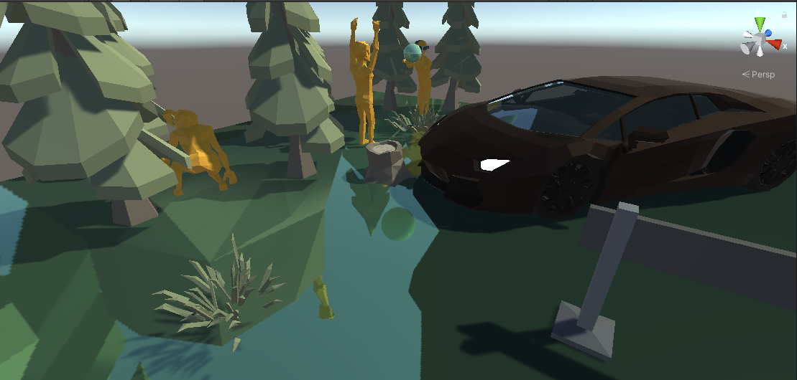

# ReflectionProbeについて
Unityでは反射を再現するのにReflectionProbe(以下プローブ)という機能を用います．  
通常，プローブを使う場合，反射をさせたいオブジェクトの位置と同じ位置にプローブを置きます．  

  
  
小物などの場合はこの方法で反射はそれなりに正しい見た目として反映されると思います．  
しかし，平面等で構成される床に上記の方法で反射を適用した場合，破綻がかなり目立ちます．
Planeの反射に対して↓画像みたいにプローブを置くと...  
  
結果として正しくない反射が写りこむ  
画像右側に関してはほとんどが車の反射で覆い隠されてしまっている.  
  

# プローブの位置を変えて対策する  
解決法に関しては[こちらのブログ記事](http://karanokan.info/2018/10/17/post-1284/)を参考にしました．
要は反射面を軸に対称の位置にプローブを置けばいいようです．  
  
イラストを用意するのが大変だったので  
https://community.arm.com/developer/tools-software/graphics/b/blog/posts/combined-reflections-stereo-reflections-in-vr  
こちらから拝借させて頂きました...  
ブログ記事でも実装がありますし，なんならプローブを使わない方法なんかも紹介されているので，一度見てみるのをおすすめします．  
しかし，初心者がハマるかもしれない点としてPlane(反射面)のy座標が0であるのが前提の実装だったので，本記事ではそれに対応したものを紹介しようと思います．  

```csharp
using UnityEngine;
using System.Collections;
 
public class setProbePosition: MonoBehaviour
{

    [SerializeField]
    public GameObject plane;//鏡面反射を行うPlane
    private ReflectionProbe probe;
    private Transform trfMainCam;
    private Transform trfPlane;

    void Start()
    {
        probe = gameObject.GetComponent<ReflectionProbe>();
        trfMainCam = Camera.main.transform;
    }

    void Update()
    {
        //差分距離導出
        float _diffDistance = GetDiffDistance();
        SetPosition(_diffDistance);
    }

    private void SetPosition(float _diffDist)
    {
        probe.transform.position = new Vector3(trfMainCam.position.x, trfMainCam.position.y - (_diffDist * 2.0f), trfMainCam.position.z);
    }

    private float GetDiffDistance()
    {
        float _dist =  Mathf.Abs(trfMainCam.position.y - plane.transform.position.y);
        if (trfMainCam.position.y < plane.transform.position.y)
        {
            //カメラより上に平面があった場合にprobeとの位置が逆転するための対策
            _dist *= -1.0f;
        }

        return _dist;
    }
}
```
作成したスクリプトを反射させたいplaneのプローブに適用して，インスペクタから対象とするplaneを指定してやれば使えるようになります．　　

関数にまとめたりしたので若干実装が違いますが，ブログ記事と違う部分はprobeのy座標を決定するのに，カメラの-1y座標としていた部分です．  
`-trfMainCam.position.y` この部分を  
`trfMainCam.position.y - (_diffDist * 2.0f)`  
に変更しています．  
`_diffDist`はカメラとplaneとのy軸上の差分距離が`GetDiffDistance()`で計算されています．基本的にはカメラとplaneとで減算をしているだけです．  
ただし，平面が天井のようにカメラの上に存在する場合は算出値をそのまま使うとプローブとの位置関係がおかしくなってしまうので`-1.0`を乗算することで対策しています．  
あとはカメラのy座標と`_diffDist`を2倍したものを減算してやれば，常にカメラとplaneの位置に対応した位置にプローブが移動するようになります．  
これのメリットには，planeのy座標が0でないときはもちろん，ゲーム中の移動床などでも反射の破綻がなくなることがあげられます．  

# 結果
良い感じ  
  

# 最後に
実はこの実装だけだと足りない処理に，planeの上のオブジェクトがplaneを貫通していたりすると，プローブが貫通した部分に関しても反射として取り込んでしまいます．  
先ほども紹介した[ブログ記事](http://karanokan.info/2018/10/17/post-1284/)ではプローブを使わない方法で問題の対策をしていますので，もしもそちらで困っていたらブログを覗いてみることをおすすめします．  
(ほとんどブログ記事と一緒ですが似たような記事が少なかったので初心者がたどりつきやすくなる意味を含めて投稿しました)  